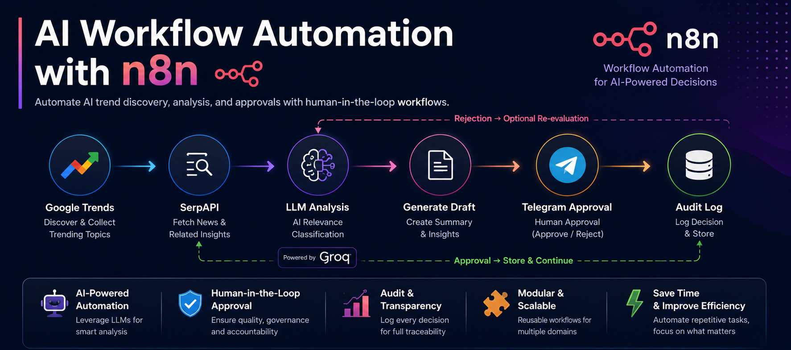
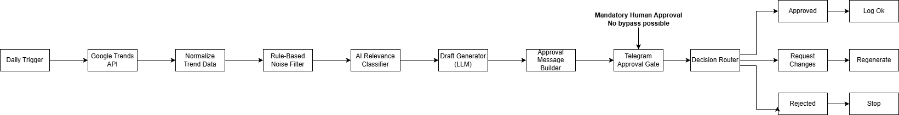

<p align="center">
  
</p>

# AI Workflow Automation with n8n

<p align="center">


</p>

> AI-powered workflow automation for intelligent trend monitoring, relevance classification, human approval, and audit logging.



---

## Overview

This project demonstrates how AI-powered automation workflows can be built using **n8n** to monitor AI-related trends, filter irrelevant information, generate insight-driven drafts, and enforce a mandatory human approval process before downstream execution.

The workflow combines traditional automation with Large Language Models (LLMs) to create a scalable and reusable solution suitable for content governance, enterprise automation, and AI-assisted decision support.

---

## Features

- Automated AI trend detection
- Google Trends integration
- Rule-based noise filtering
- AI-powered relevance classification
- Insight-based draft generation
- Human approval through Telegram
- Audit logging
- Modular workflow design
- Configurable workflow categories
- Production-oriented architecture

---

## Workflow Pipeline

```text
Daily Trigger
      │
      ▼
Google Trends
      │
      ▼
Normalize Trend Data
      │
      ▼
Rule-Based Filtering
      │
      ▼
AI Relevance Classification
      │
      ▼
Insight Draft Generation
      │
      ▼
Telegram Approval
      │
      ├─────────────┐
      ▼             ▼
Approve        Request Changes
      │             │
      ▼             │
Audit Log ◄─────────┘
      │
      ▼
Downstream Workflows
```

---

## Repository Structure

```text
AI-Workflow-Automation-with-n8n/
│
├── workflows/
├── architecture/
├── docs/
├── assets/
├── LICENSE
├── .gitignore
└── README.md
```

---

## Technologies Used

- n8n
- Google Trends API
- SerpAPI
- Groq LLM
- Telegram Bot API
- REST APIs
- JSON
- Prompt Engineering

---

## Workflow Variants

This repository includes four workflow configurations:

- AI Governance
- AI Regulation
- AI Security
- AI Education

Each workflow follows the same architecture while targeting a different AI domain.

---

## Installation

1. Clone the repository.

```bash
git clone https://github.com/YOUR_USERNAME/AI-Workflow-Automation-with-n8n.git
```

2. Import one of the workflow JSON files into n8n.

3. Configure your credentials:

- SerpAPI
- Groq
- Telegram

4. Execute the workflow manually or activate the scheduler.

---

## Architecture

The workflow consists of six main stages:

1. Trend Detection
2. Noise Filtering
3. AI Classification
4. Draft Generation
5. Human Approval
6. Audit Logging

See the architecture diagram for additional details.

---

## Documentation

Detailed technical documentation is available in the `docs/` directory.

It includes:

- Workflow architecture
- Setup instructions
- Troubleshooting
- Complete workflow documentation

---

## Future Improvements

- Slack integration
- Microsoft Teams approval
- Email approval
- Multi-language support
- Additional LLM providers
- Workflow analytics dashboard

---

## License

This project is licensed under the MIT License.

## My Contributions

This project was developed as part of an AI automation internship and demonstrates my experience in:

- Designing modular n8n workflows
- Integrating Large Language Models (LLMs)
- Building REST API integrations
- Implementing human-in-the-loop approval systems
- Designing audit logging and governance workflows
- Developing reusable workflow architectures
